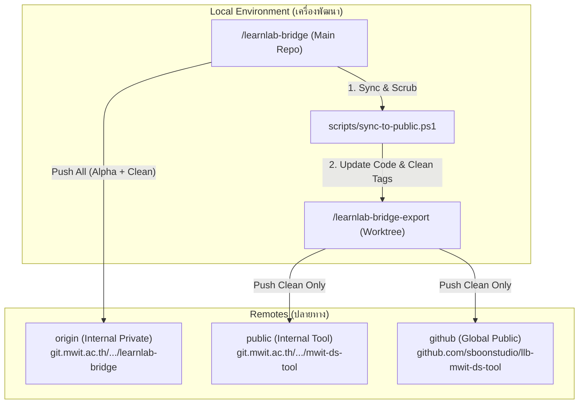

# LearnLab Bridge: Git Architecture & Governance Overview

เอกสารฉบับนี้สรุปโครงสร้างการบริหารจัดการ Git และระบบ Remotes ของโครงการ LearnLab Bridge เพื่อความต่อเนื่องในการพัฒนาและรักษามาตรฐานความปลอดภัย

## 📊 ผังโครงสร้างระบบ (Architecture Diagram)

## 🛠 องค์ประกอบหลัก (Core Components)

### 1. การแยกพื้นที่ทำงาน (Worktree Isolation)
- **Primary Repo (`/learnlab-bridge`)**: 
    - Branch: `main` (และ `develop`, `feature/*`)
    - หน้าที่: พัฒนาฟีเจอร์, แก้ไขบั๊ก, เก็บไฟล์ความลับ และประวัติการพัฒนาทั้งหมด
- **Export Worktree (`/learnlab-bridge-export`)**:
    - Branch: `public/export-mwit-ds`
    - หน้าที่: เป็นพื้นที่ "สะอาด" สำหรับส่งออกโค้ดสู่สาธารณะ ไม่มีความลับหลุดลอด

### 2. ระบบ Remotes (Multi-Remote Strategy)
- **`origin`**: ที่เก็บข้อมูลหลักแบบปิด (Private) เก็บประวัติทุกอย่าง
- **`public`**: ช่องทางเผยแพร่ภายในโรงเรียน (MWIT Internal Tool)
- **`github`**: ช่องทางเผยแพร่ระดับสากล (Global Distribution) ภายใต้ชื่อ **llb-mwit-ds-tool**

### 3. มาตรฐานการทำเวอร์ชัน (Tagging Policy)
ใช้กลยุทธ์ **"Separate & Clean"**:
- **Internal Tags (`vX.X.X-alpha`)**: ติดตามการพัฒนาภายใน (Push ไปที่ `origin` เท่านั้น)
- **Clean Tags (`vX.X.X`)**: เวอร์ชันเสถียรสำหรับผู้ใช้ทั่วไป (Push ไปที่ทุก Remotes)

## 🔄 ขั้นตอนการทำงานมาตรฐาน (Standard Workflow)

1.  **Develop**: พัฒนาใน `/learnlab-bridge`
2.  **Sync**: รัน `.\scripts\sync-to-public.ps1` เพื่อเตรียมโค้ดสาธารณะ
    - ระบบจะลบไฟล์ตาม `.public-ignore`
    - ระบบจะคุม Encoding เป็น UTF-8 (No BOM)
    - ระบบจะสร้างเลขเวอร์ชันสะอาด
3.  **Distribute**: เข้าไปที่ `/learnlab-bridge-export` แล้วรัน:
    - `git push origin public/export-mwit-ds`
    - `git push public public/export-mwit-ds:main --tags`
    - `git push github public/export-mwit-ds:main --tags`

---
*บันทึกข้อมูลล่าสุด: 6 มิถุนายน 2569*
